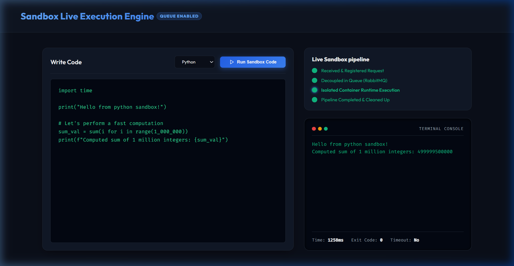
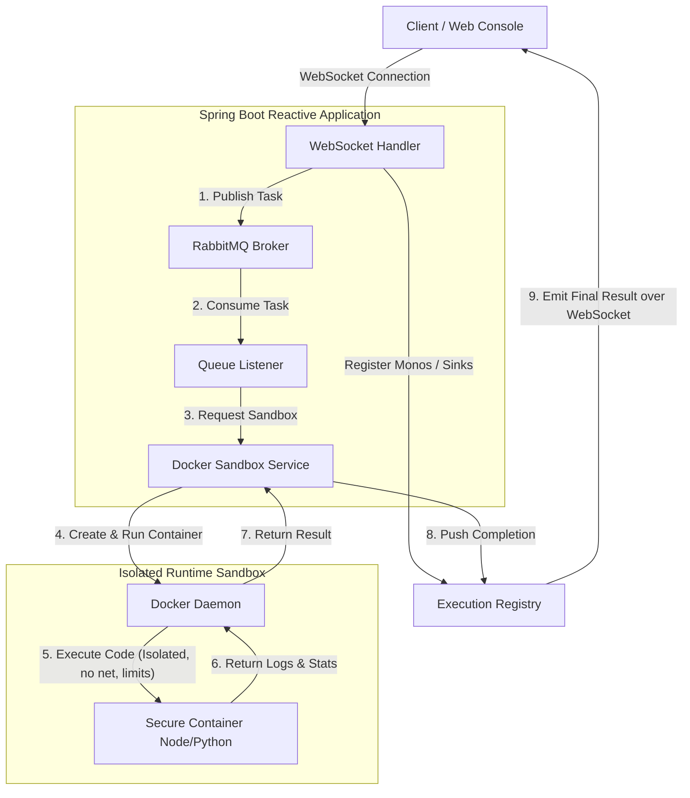

# Reactive Code Sandbox & Execution Engine

A production-grade, asynchronous, and secure **Remote Code Execution Sandbox & Compilation Engine** built with **Spring Boot WebFlux (Reactive Programming)**, **Docker-Java API**, and **RabbitMQ (AMQP)**. 

Designed for high-throughput, non-blocking I/O (handling thousands of concurrent compilations without thread exhaustion), this engine executes untrusted python/javascript code in isolated, resource-constrained Docker containers.



---

## 🚀 Key Features

*   **Reactive & Non-Blocking**: Built on Spring WebFlux, Project Reactor, and Netty. Eliminates thread-per-request blocking I/O bottleneck during heavy compilation operations.
*   **Sandboxed Docker Isolation**: Untrusted code runs inside isolated, dynamically managed container environments.
*   **Resource Constraints**: Each container is constrained to a maximum of `128MB RAM` and `0.5 CPU cores` to prevent server starvation.
*   **Network Restriction**: Docker containers have their network disabled (`.withNetworkDisabled(true)`) to prevent malicious outbound requests.
*   **Watchdog Timeout Killers**: An asynchronous watchdog kills infinite loops or malicious hanging executions after a `5-second` timeout.
*   **Decoupled Broker Integration (RabbitMQ)**: Uses an AMQP message broker to handle and queue incoming compilation tasks, shielding the primary server from traffic surges.
*   **WebSocket Event Streaming**: Streams real-time execution progress updates (`RECEIVED`, `QUEUED`, `EXECUTING`, `COMPLETED`) directly back to the UI.
*   **Zero-Dependency Named Pipe Transport**: Native connection to the local Docker socket on Windows/Linux using `docker-java-transport-zerodep`.
*   **Hybrid Execution Fallback**: Automatically bypasses the queue and runs code directly via the sandbox engine if the RabbitMQ broker is offline.

---

## 📐 System Architecture



---

## 🛠️ Tech Stack

*   **Framework**: Spring Boot 3.3+ (WebFlux)
*   **Language Runtime**: Java 25 (Project Adoptium)
*   **Sandbox Orchestrator**: Docker Engine & Docker-Java API
*   **Message Broker**: RabbitMQ (Spring AMQP)
*   **Build Tool**: Gradle
*   **Reactive Toolkit**: Project Reactor & Netty

---

## 🏁 Getting Started

### Prerequisites
1.  **Java 25 SDK** installed.
2.  **Docker Desktop** running locally.
3.  **RabbitMQ** (Optional - system falls back to direct execution if offline).

### Running the Application

1.  **Clone the repository**:
    ```bash
    git clone https://github.com/om-mane-coder/reactive-code-execution-engine.git
    cd reactive-code-execution-engine
    ```

2.  **Run with Docker Compose** (Recommended for full decoupled queue testing):
    ```bash
    docker compose up --build
    ```
    *This will spin up both the Spring Boot app and RabbitMQ, auto-enabling queue decoupling.*

3.  **Run with Gradle** (Direct Execution Fallback):
    ```bash
    ./gradlew bootRun
    ```

4.  **Open the Web Dashboard**:
    Go to [http://localhost:8085/](http://localhost:8085/) to access the premium interactive developer workspace.


---

## ⚙️ Configuration Properties
Customize properties in `src/main/resources/application.properties`:
```properties
# Enable/Disable decoupling queue
app.use-queue=false

# Port Configuration
server.port=8085

# Docker Daemon Connection (Optional - automatically detected based on OS if commented out)
# docker.host=unix:///var/run/docker.sock
```


---

## 🔒 Security Measures In-Depth

1.  **Resource Throttling**:
    Prevents execution of Fork Bombs (`:(){ :|:& };:`) or heavy CPU computations by strictly limiting memory and CPU shares at the Docker daemon level.
2.  **Ephemeral File System**:
    Each request creates a unique temporary directory to store files, which is automatically deleted upon execution completion to prevent file leaks.
3.  **Network Isolation**:
    Network interfaces are disabled inside the containers to avoid execution code initiating DDOS attacks, sending spam, or communicating with external command & control servers.
